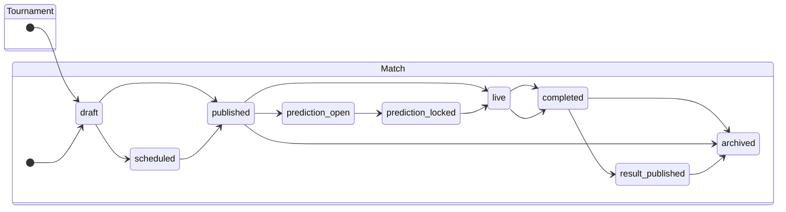

# Tournament & Match Status Reference

| Property | Value |
|----------|--------|
| Version | 1.0 |
| Audience | Product, engineering, QA |
| Perspective | **Contestant UI** (what contestants see and can do) |
| Source of truth | `tournament.domain.js`, `match.domain.js`, contestant pages & renderers |

This document describes every tournament and match status, what happens when an entity enters that state, and how the contestant-facing UI behaves.

---

## Overview

**Important:** Tournament status and match status are independent but related. A tournament must be **Published**, **Live**, or **Completed** (and **Visible**) before contestants can see it. Individual matches must additionally be **Published** (or later) and marked **Visible** before they appear in contestant views.

---

## Tournament Statuses

| Status | Label | Visible to contestants? |
|--------|-------|-------------------------|
| `draft` | Draft | No |
| `published` | Published | Yes (if visibility = Visible) |
| `live` | Live | Yes (if visibility = Visible) |
| `completed` | Completed | Yes (if visibility = Visible) |
| `archived` | Archived | No |

Contestant visibility is determined by `TournamentDomain.isTournamentVisibleToContestants()`: the tournament must have **visibility = `visible`** and status must be **`published`**, **`live`**, or **`completed`**.

### `draft`

**What happens**

- Tournament is being configured by administrators.
- Not included in contestant tournament lists.
- Matches may exist in draft, but contestants never see them.

**Contestant UI**

| Area | Behavior |
|------|----------|
| Dashboard | Shows empty state: *"No Active Tournaments — Once a tournament is published, you can begin submitting predictions."* |
| Tournaments (`/tournaments`) | Tournament does not appear. List shows *"No tournaments are available right now."* if no other visible tournaments exist. |
| Matches / Predictions | No matches from this tournament are shown. |
| Leaderboard | Not applicable for this tournament. |

---

### `published`

**What happens**

- Tournament becomes visible to contestants (when visibility = Visible).
- Administrators can publish matches within the tournament.
- Prediction windows on matches can open according to tournament configuration (`predictionOpenHoursBeforeKickoff`, `predictionLockMinutes`).
- If no other tournament is currently active, publishing automatically sets this tournament as **active** (only one active tournament at a time). Otherwise administrators must use **Set Active** manually.

**Contestant UI**

| Area | Behavior |
|------|----------|
| Dashboard | Tournament appears in the tournament list. If set as active, it drives prediction stats and upcoming-match widgets. Welcome message and stats reflect available matches. |
| Tournaments (`/tournaments`) | Shown as a card with a **Published** badge (blue). Contestant can open tournament detail (name, season, sport, type, draw rules). |
| Matches (`/matches`) | Published, visible matches from this tournament appear. |
| Predictions (`/predictions`) | Match cards grouped by round. **Make Prediction** / **Edit Prediction** buttons appear when the match prediction window is open. |
| Leaderboard | Shown only if `settings/general.leaderboardVisible === true`. Otherwise navigation is hidden and direct access shows *"The tournament organizer has not yet made the leaderboard available."* |

---

### `live`

**What happens**

- Tournament has officially started.
- Matches follow configured prediction lock rules; automatic status transitions may move matches to `prediction_open`, `prediction_locked`, or `live` based on kickoff time.
- Predictions already submitted remain locked once the per-match lock window passes.

**Contestant UI**

| Area | Behavior |
|------|----------|
| Dashboard | Active tournament card shows **Live** badge (green). Upcoming matches and pending-prediction counts update in real time. |
| Tournaments | Status badge changes to **Live**. Detail page remains accessible. |
| Matches | Status badges reflect effective match state (e.g. **Prediction Open**, **Prediction Locked**, **Live**). Countdown timers show time until kickoff. |
| Predictions | Open matches: submit or edit. Locked/live matches: **Prediction Locked** disabled button. |
| Leaderboard | Available when enabled; may show interim standings as results are published. |

---

### `completed`

**What happens**

- Tournament is finished.
- Tournament becomes **read-only** for administrators (`isTournamentReadOnly`).
- No new predictions are accepted at the tournament level.
- Historical data (predictions, results, scores) is preserved.

**Contestant UI**

| Area | Behavior |
|------|----------|
| Dashboard | Tournament still listed if visible. Stats show final submitted/pending counts. |
| Tournaments | **Completed** badge (yellow/amber). Detail page remains viewable. |
| Matches | All matches shown with final statuses (**Result Published** where applicable). Official results and prediction comparison visible on match detail. |
| Predictions | All prediction actions disabled. Cards show submitted predictions, results, and points (when scoring is calculated). **View Details** link replaces action buttons on completed matches. |
| Leaderboard | Final standings when leaderboard is enabled. |

---

### `archived`

**What happens**

- Tournament is moved to historical storage.
- Excluded from default admin and contestant lists (`includeArchived: false`).
- Fully read-only.
- Administrators may permanently delete an archived tournament from the Archived tab. Permanent delete removes all tournament data (matches, predictions, leaderboard cache) regardless of prediction count. Contestants will no longer see any trace of the tournament, including prediction history.

**Contestant UI**

| Area | Behavior |
|------|----------|
| Dashboard | Tournament no longer appears. May trigger empty-state messaging if no other visible tournaments exist. |
| Tournaments | Not listed. |
| Matches / Predictions | Not accessible through normal navigation. |
| Leaderboard | Not accessible for this tournament. |

---

### Tournament visibility (separate from status)

Visibility is configured independently via `visibility`:

| Visibility | Contestant effect |
|------------|-------------------|
| `visible` | Eligible for display when status is `published`, `live`, or `completed`. |
| `hidden` | Never shown to contestants, regardless of status. |
| `archived` | Never shown to contestants. |

---

## Match Statuses

| Status | Label | Visible to contestants? |
|--------|-------|-------------------------|
| `draft` | Draft | No |
| `scheduled` | Scheduled | No |
| `published` | Published | Yes (if `visible = true`) |
| `prediction_open` | Prediction Open | Yes (if `visible = true`) |
| `prediction_locked` | Prediction Locked | Yes (if `visible = true`) |
| `live` | Live | Yes (if `visible = true`) |
| `completed` | Completed | Yes (if `visible = true`) |
| `result_published` | Result Published | Yes (if `visible = true`) |
| `archived` | Archived | No |

Contestant visibility requires **`visible = true`** and status in the set: `published`, `prediction_open`, `prediction_locked`, `live`, `completed`, `result_published`.

### Effective (automatic) status

When a match is loaded, the system may **automatically transition** its stored status based on kickoff time and tournament configuration:

| Condition | Effective status |
|-----------|------------------|
| Before prediction window opens | Stays `published` (predictions **Closed**) |
| Inside prediction window | `prediction_open` |
| After lock time, before kickoff | `prediction_locked` |
| At or after kickoff | `live` |
| Admin-set terminal states | `completed`, `result_published` are not auto-changed |

Default configuration: predictions open **48 hours** before kickoff and lock **10 minutes** before kickoff (configurable per tournament).

---

### `draft`

**What happens**

- Match is created but not scheduled for contestants.
- `visible` defaults to `false`.

**Contestant UI**

- Match does not appear on **Matches**, **Predictions**, or **Dashboard** upcoming-match widgets.

---

### `scheduled`

**What happens**

- Kickoff and teams are set; match is scheduled internally.
- Still admin-only; not visible to contestants unless published.

**Contestant UI**

- Not shown anywhere in contestant views.

---

### `published`

**What happens**

- Administrator publishes the match (`visible = true`).
- Match appears in contestant lists.
- If current time is **before** the prediction open window, predictions are **Closed** (stored status may remain `published`).

**Contestant UI**

| Element | Behavior |
|---------|----------|
| Match card | Teams, round, kickoff time, countdown to kickoff. |
| Prediction badge | **Prediction Pending** (warning) if no submission yet. |
| Prediction field | Shows *Closed* — **Make Prediction** may appear but submission will fail until window opens (or admin manually opens predictions). |
| Action button | **Make Prediction** shown when effective prediction status is Open; otherwise locked/disabled state. |

---

### `prediction_open`

**What happens**

- Prediction window is active (automatically by time, or manually by admin).
- Contestants may submit or edit predictions until the lock time.
- `MatchDomain.isPredictionOpen()` returns `true` while `now < kickoff − lockMinutes`.

**Contestant UI**

| Element | Behavior |
|---------|----------|
| Status badge | **Prediction Open** (green). |
| Prediction label | *Open* on match detail. |
| Match card badge | **Prediction Pending** or **Prediction Submitted**. |
| Actions | **Make Prediction** (no existing prediction) or **Edit Prediction** (existing prediction). |
| Form | Score inputs enabled; penalty winner selector shown for knockout rounds when predicting a draw. |

---

### `prediction_locked`

**What happens**

- Prediction window has closed (automatic lock before kickoff, or manual admin close).
- Existing predictions are preserved and cannot be edited.
- Match has not yet kicked off (otherwise effective status becomes `live`).

**Contestant UI**

| Element | Behavior |
|---------|----------|
| Status badge | **Prediction Locked** (amber/warning). |
| Prediction label | *Locked* on match detail. |
| Match card badge | **Prediction Locked** (lock icon). |
| Actions | **Prediction Locked** button — disabled, full width. |
| Submitted prediction | Still displayed read-only on the card. |
| Countdown timer | Hidden on contestant dashboard when predictions are locked. |

---

### `live`

**What happens**

- Kickoff time has passed (or admin manually set **Go Live**).
- No prediction changes allowed.
- Match is in progress; result not yet entered.

**Contestant UI**

| Element | Behavior |
|---------|----------|
| Status badge | **Live** (red). |
| Countdown | Kickoff time shown; countdown may show elapsed/in-progress state. |
| Actions | **Prediction Locked** — no submit or edit. |
| Match detail | Shows teams, kickoff, and locked prediction status. No official result yet. |

---

### `completed`

**What happens**

- Match has finished; administrator enters the result.
- Result is stored but not yet published to contestants.
- Scoring has not run yet.

**Contestant UI**

| Element | Behavior |
|---------|----------|
| Status badge | **Completed** (info blue). |
| Official result | Not shown until result is published. |
| Actions | Predictions remain locked. |
| Match detail | No **Official Result** section yet. |

---

### `result_published`

**What happens**

- Administrator publishes the official result (`result.published = true`).
- Scoring engine processes predictions and updates leaderboard (when enabled).
- Match becomes read-only.

**Contestant UI**

| Element | Behavior |
|---------|----------|
| Status badge | **Result Published** (green). |
| Match detail | **Official Result** section: final score, winning team, winner resolution. |
| Prediction comparison | Side-by-side view of contestant prediction vs official result (on match detail page). |
| Match card | Final scores displayed. Points section shows winner/exact-score indicators and points earned. |
| Actions | **View Details** link replaces prediction buttons. |

---

### `archived`

**What happens**

- Match is archived (`visible = false`, status = `archived`).
- Removed from contestant match lists.

**Contestant UI**

- Match no longer appears on **Matches** or **Predictions** pages.
- Direct URL access returns *"Match not found"* or equivalent empty state.

---

### Match visibility (separate from status)

Administrators can **Hide** a match without changing its lifecycle status. When `visible = false`:

- Match is filtered out of all contestant queries (`contestantOnly: true`).
- Prediction submission is rejected with *"Match is not visible"*.

---

## Contestant UI by Page

### Dashboard (`/`)

| Condition | UI behavior |
|-----------|-------------|
| No visible tournaments | Empty state with link to Tournaments page. |
| Active tournament set | Shows tournament name, season, prediction stats (total / submitted / pending). |
| Upcoming matches | Up to 5 future kickoffs from visible matches. |
| Leaderboard disabled | Widget hidden; message: *"Leaderboard will become available once enabled by the tournament organizer."* |
| Leaderboard enabled | Link to `/leaderboard`. |

### Tournaments (`/tournaments`)

Lists only tournaments with status `published`, `live`, or `completed` and visibility `visible`. Each card shows status badge and **View Tournament** action.

### Matches (`/matches`)

Lists all contestant-visible matches. Clicking a match opens detail with status badge, kickoff, prediction status, and official result (when published).

### Predictions (`/predictions`)

Primary workspace for submitting predictions. Shows stats cards and match cards grouped by round. Button states:

| State | Button |
|-------|--------|
| Window open, no prediction | **Make Prediction** |
| Window open, has prediction | **Edit Prediction** |
| Window closed / live / completed | **Prediction Locked** (disabled) |
| Result published | **View Details** |

### Leaderboard (`/leaderboard`)

Controlled by `settings/general.leaderboardVisible`, not directly by tournament or match status. When hidden, contestants see an informational page with a link back to Predictions.

---

## Quick Reference: Can a contestant predict?

| Tournament status | Match status (effective) | `visible` | Can predict? |
|-------------------|--------------------------|-----------|--------------|
| `draft` / `archived` | Any | Any | No — tournament not visible |
| `published` / `live` | `published` (before window) | `true` | No — window closed |
| `published` / `live` | `prediction_open` | `true` | **Yes** |
| `published` / `live` | `prediction_locked` / `live` | `true` | No — locked |
| `completed` | Any visible | `true` | No — tournament finished |
| Any visible | `completed` / `result_published` | `true` | No — match finished |
| Any | Any | `false` | No — match hidden |

---

## Related source files

| Topic | File |
|-------|------|
| Tournament status enum & transitions | `public/js/domain/tournament.domain.js` |
| Match status enum & effective status | `public/js/domain/match.domain.js` |
| Match lifecycle actions | `public/js/match/match-status.service.js` |
| Contestant tournament list | `public/js/tournament/tournament.service.js` → `listTournamentsForContestant()` |
| Contestant match list | `public/js/match/match.repository.js` → `contestantOnly` filter |
| Prediction edit rules | `public/js/prediction/prediction-submission.service.js` → `canEditPrediction()` |
| Match card UI | `public/js/match/match-card.component.js` |
| Contestant match detail | `public/js/match/renderers/detail.renderer.js` → `renderContestantMatchDetail()` |
| Status badges | `public/js/tournament/renderers/status-badge.renderer.js`, `public/js/match/renderers/status-badge.renderer.js` |
